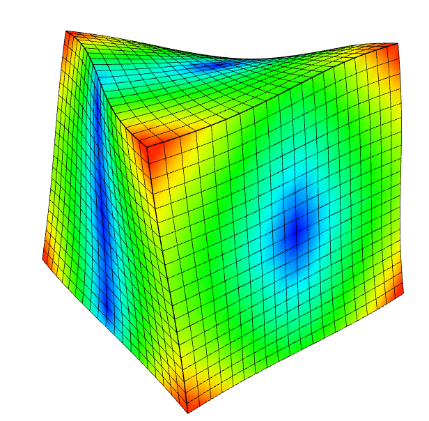
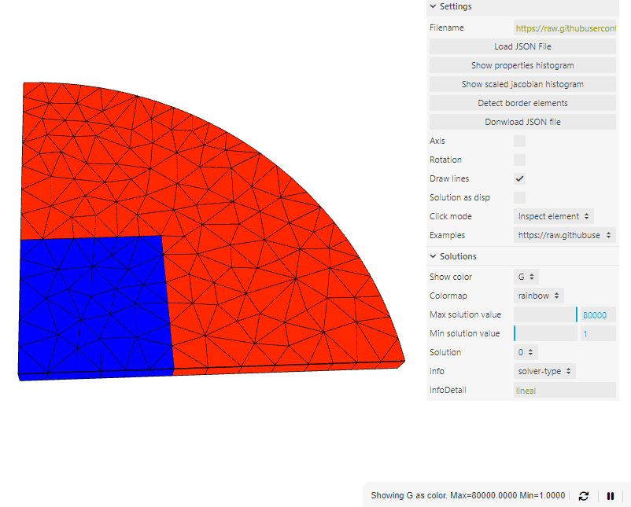

# FEM Viewer

Try it online!!
[https://zibramax.github.io/FEMViewer/](<[images/START.gif](https://zibramax.github.io/FEMViewer/)>)

A 3D, 2D and 1D FEM results viewer with post process capabilities.

  
  
  

Several options to modify the visualization.

## Options

### Load JSON

Load JSON file of geometry

### Draw Lines

Allows to display geometry lines

  
  

### Progress bars

Progress bar for second plane actions. Allows to reload the geometry and stop the redraw of the geometry.

  

### Colors

Represent the solution and derivatives as colors

  
  

Use sliders to control the color values

Different color pallettes

  
  

### Click modes

Use the mouse cursor to interact with geometry

  
  

#### Inspect element

Click in a element to open a separated window. Move the cursor over the element to interpolate the solution

  

#### Delete element

Click in a element to delete it. Just for fun?

  

### Displacement animation

For displacement problems, the viewer creates an animation. Yoou can modify the magnifier factor.

  

### Displacement animation

For problems with no displacement field (as temperature or torsion), the viewer can show the solution as colors and as displacement.

  

### Multiple solutions in the same file

For geometries with different solutions (as eigenvalue problems, time dependent or non-lineal) the viewer allows to select the solution. You can use the left and right arrow to change between solutions

  	

For each solution, the viewer shows solution information

### Histograms

Shows element properties histogram and scaled jacobian histograms

The viewer shows the element properties with different colors (WIP)

### Border element detection

Detects the border elements of a 3D geometry

And more...

## JSON Geometry input file

WIP

## Examples

Play with them!
